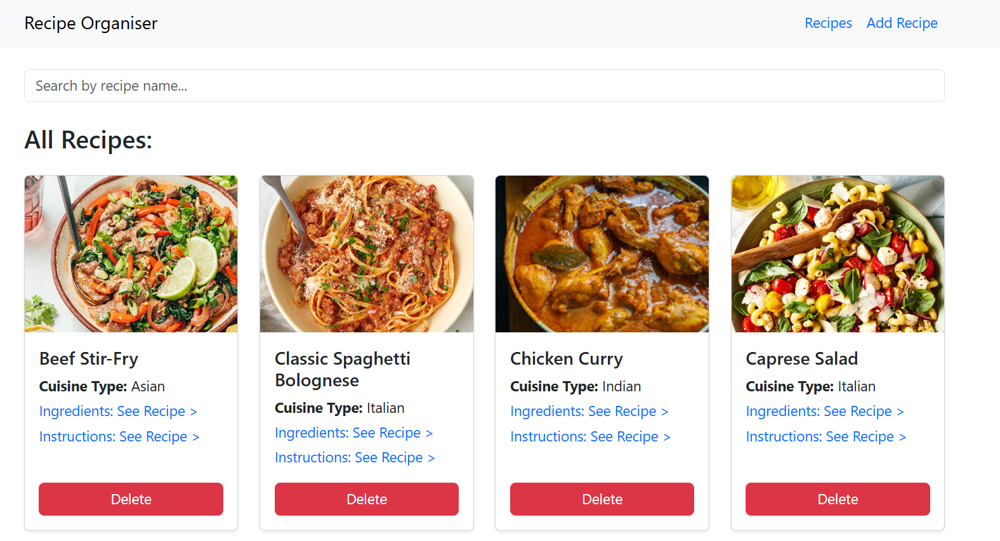

# Recipe Organizer

---

A MERN Stack Recipe Organizer app that allows users to browse, search, and manage recipes. Users can view recipe details and add new recipes easily.
Built with React, Node.js, Express, and MongoDB.

---

## Demo Link

[Live Demo](https://recipe-hub-sandy.vercel.app)

---

## Quick Start

```
git clone https://github.com/your-username/RecipeHub.git

cd RecipeHub
npm install
npm start
```

---

## Technologies

- React Js
- React Router
- Bootstrap
- Node Js
- Express Js
- MongoDB
- Reast APIs

---

## Demo Video

Watch a walkthrough (5-7 minutes) of all major features of this app: <br>
[Drive Video Link](https://drive.google.com/file/d/12qB4sDfHySqPwiFUEbPzTM5BWWfO5_yG/view?usp=sharing)

---

## Reference 




---


## Features

- Recipe Listing – View all recipes in a responsive card layout
- Search – Search recipes by name
- Recipe Details – View cuisine, ingredients, and instructions
- Add Recipe – Add new recipes using a form
- Notifications – Toast messages for success/error
- Responsive UI – Works on mobile, tablet, and desktop

---

## API Reference

### GET /api/recipe

Get all recipe.

### POST /api/recipe/add

Create a new recipe

### DELETE /api/recipe/:id

Delete a recipe

---

## Environment Setup

**Backend**

```
PORT=8001
MONGODB_URI=your_mongodb_url
FRONTEND_URL=http://localhost:3000

```

**Frontend**

```
REACT_APP_API_BASE_URL=http://localhost:8001/api

```
---

## Contact

For bugs or feature requests, please reach out to [sourabhpande43@gmail.com](mailto:sourabhpande43@gmail.com)
